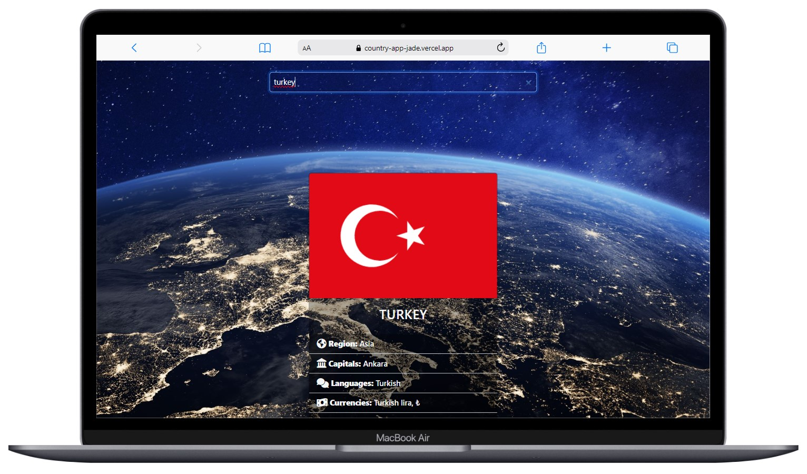

# Country App

  

## About the Project

A web application that allows users to search for countries and view detailed information about them. The app fetches country data from [restcountries](https://restcountries.com/v3.1/all) API and provides details such as flag, region, capital, languages, currencies, population, borders, and a link to Google Maps.

## Table of Contents

- [Features](#features)
- [Usage](#usage)
- [Screenshots](#screenshots)

## Features

- Autocomplete search for countries.
- Displays detailed information about the selected country.
- Utilizes the [restcountries](https://restcountries.com/v3.1/all) API for country data.
- Responsive design using Bootstrap for a user-friendly experience.
- Background image for an aesthetically pleasing look.

## Usage

1. Open the web page in a browser.
2. Use the search input to type the name of the country you want to explore.
3. As you type, the app provides autocomplete suggestions based on the input.
4. Click on a country from the suggestions or continue typing to refine your search.
5. The detailed information about the selected country, including flag, region, languages, currencies, population, and borders, will be displayed.
6. Click on the link provided under "Map" to view the country on Google Maps.

## Screenshots

  
  
  

## Compatibility

The project is compatible with both wide-screen computers and mobile devices.